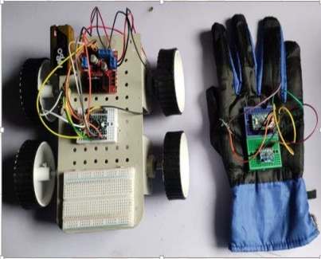

# Gesture Controlled Wheelchair

An Arduino-based embedded systems project that enables wheelchair movement through **hand gesture recognition** using an accelerometer sensor. The system improves mobility assistance by converting hand gestures into wireless movement commands.

---

## Project Overview

The Gesture Controlled Wheelchair is designed to help users control wheelchair movement without using a traditional joystick. Hand gestures are detected by an accelerometer, processed by an Arduino using Embedded C, and transmitted wirelessly to the wheelchair, where a motor driver controls the DC motors.

---

## Project Images

### Gesture Controller

### RX Circuit

### TX Circuit

---

## Hardware Components

| Component | Purpose |
|-----------|---------|
| Arduino Uno | Main controller |
| Accelerometer (MPU6050/ADXL335) | Detects hand gestures |
| RF/Bluetooth Module | Wireless communication |
| L298N Motor Driver | Controls DC motors |
| DC Motors | Wheelchair movement |
| Battery | Power supply |
| Chassis & Wheels | Mechanical structure |

---

## Software Used

- Arduino IDE
- Embedded C
- Serial Communication

---

## Working Principle

1. The accelerometer detects hand movements.
2. Arduino reads and processes sensor values.
3. The gesture is converted into movement commands.
4. Commands are transmitted wirelessly to the receiver.
5. The receiver Arduino controls the L298N motor driver.
6. The motors move the wheelchair in the required direction.

---

## Supported Gestures

| Gesture | Wheelchair Action |
|----------|-------------------|
| Tilt Forward | Move Forward |
| Tilt Backward | Move Backward |
| Tilt Left | Turn Left |
| Tilt Right | Turn Right |
| Neutral Position | Stop |

---

## Circuit Architecture

**Transmitter Side**
- Arduino Uno
- Accelerometer
- RF/Bluetooth Transmitter
- Battery

**Receiver Side**
- RF/Bluetooth Receiver
- Arduino Uno
- L298N Motor Driver
- DC Motors
- Battery

---

## Applications

- Smart mobility assistance
- Assistive technology for elderly and disabled users
- Embedded systems education
- Robotics projects

---

## Future Improvements

- Obstacle detection using ultrasonic sensors
- Voice control
- Mobile application control
- GPS tracking
- Emergency SOS feature

---

## Skills Demonstrated

- Embedded C Programming
- Arduino Programming
- Sensor Interfacing
- Motor Driver Interfacing
- Wireless Communication
- Embedded Systems Design
- Hardware Integration
